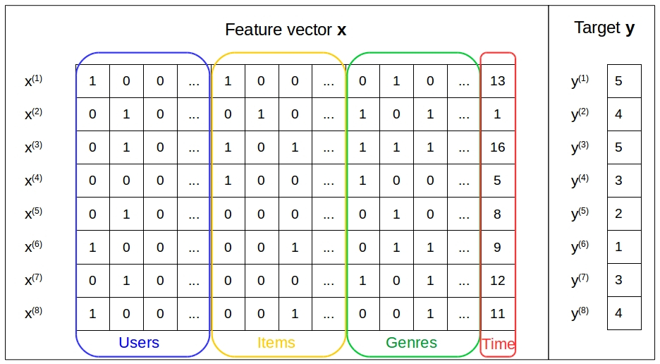

# tfdiv

The following is a library for Factorization Machines in [TensorFlow™](https://www.tensorflow.org/).  
The library provides standard *Classifier* and *Regression* modules,
that can be extended by defining custom `loss_function`.  
It also provides a *Ranking* module for several classifiers. 
We implemented both pointwise and pairwise learning-to-rank, 
in particular we also provide the 
*Bayesian Personalized Ranking* **[2]**.

### What are Factorization Machines?

Factorization Machines (FMs) are a new model class devised by S. Rendle **[1]**.    
Similarly to Support Vector Machines (SVM), 
they are a general predictor working with any 
real-valued feature vector. However, FMs model all
interactions between variables using factorized parameters. 
Thus, they estimate high-order interactions even in 
problems with huge sparsity like _Recommender Systems_.

Factorized parameters estimation is a shared feature 
with many other factorization models like Matrix Factorization.
In contrast to those, FMs can handle the general prediction tasks 
whereas other factorization models work with specific input data. 




#### FMs' Model Equation
In a linear model, given a vector `x` models its predicted output `y` is as follows:

  

where `w` are the estimated weights of the model.  
Here, the interactions between the input variables `x_i` 
are purely additive, whereas it might be useful to 
model the interactions between your variables, e.g., `x_i * x_j`.
Thus, such model class has additional parameters to estimate 
the interactions between variables, 
i.e. `V` whose dimension depends on th order of interactions.   
Therefore, the equation for a model that captures the pairwise interaction between variables looks like as follows.  


However, in this formulation the number of parameters 
grows exponentially with the number of features in the feature vector, 
e.g. in the second order interaction model there are `O(n^2)` parameters introduced. 

Rendle mathematically demonstrated that FMs 
can reduce the number of parameters to estimate by factorizing them, as follows:


 
Rendle managed to reduced both memory and time complexity to `O(k*n)` 
(i.e. linear complexity), where `k` is the number of factors.   
Therefore, the above-mentioned formulation translates 
to the following 2-way FM:


Rendle also generalized to the d-way FM, 
but we do not discuss it as it is not yet 
implemented in this library see [Currently supported features](#currently-supported-features) Section. 

## Usage

Factorization Machine classifiers implement 
```scikit-learn```'s classifier interface, thus ```tfdiv``` 
is compatible with any ```scikit-learn``` tool.  
```tfdiv``` takes as input 
```scipy.sparse.csr_matrix``` to train and predict its classifiers.   
Below we show a demo on how to use the ```tfdiv``` library, 
in particular we show how to customize the classifiers 
by passing a ```tensorflow``` compatible ```loss_function```. 
Here, we present the ```Regression``` classifier using the ```mean_absolute_error``` loss function.  

```python
from sklearn.preprocessing import OneHotEncoder
from tfdiv.fm import Regression
import tensorflow as tf 
import pandas as pd
import numpy as np

# movielens 100k dataset
PATH = "/data/ua.base"
header = ['user', 'item', 'rating', 'timestamp']

train = pd.read_csv(PATH, delimiter='\t', names=header)[header[:-1]]

enc = OneHotEncoder(categorical_features=[0, 1], dtype=np.float32)

x = train.values[:, :-1]
y = train.values[:, -1]

csr = enc.fit(x).transform(x)

epochs = 10
batch_size = 32

fm = Regression(epochs=epochs, 
                batch_size=batch_size,
                loss_function=tf.metrics.mean_absolute_error)
                
fm.fit(csr, y)

y_hat = fm.predict(csr)

```

## Installation

This package requires ```scikit-learn```, ```numpy```, ```scipy```, ```tensorflow```.

To install, you can run:

```
cd tfdiv
python setup.py install
```

## Currently supported features

Currently, only a second order factorization machine 
is supported and its implemented in its sparse version. 

The following classifiers are implemented: 
* Classifier
* Regression
* Ranking
  * Pointwise Learning-to-Rank
    * Classifier and Regression 
  * Pairwise Learning-to-Rank
    * Bayesian Personalized Ranking

* Latent Portfolio Factor
  * Pointwise Ranking
    * Classifier and Regression
  - Pairwise Ranking
    * Bayesian Personalized Ranking

### TODO

1. Support for dense tensors.
2. Arbitrary order factorization machine support
3. Implement save and restore API.
4. Generalizing Pairwise Learning-to-Ranking to enable customization

## References 

1. Rendle, Steffen. "Factorization machines." Data Mining (ICDM), 2010 IEEE 10th International Conference on. IEEE, 2010.
2. Rendle, Steffen, et al. "BPR: Bayesian personalized ranking from implicit feedback." Proceedings of the twenty-fifth conference on uncertainty in artificial intelligence. AUAI Press, 2009.